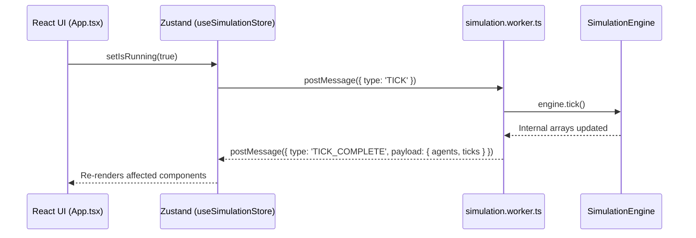

# Clinical AI Studio Architecture

This document maps the async architectural foundations of the Clinical AI Studio, emphasizing how the pure medical twin logic interfaces with the React UI via Web Workers and Zustand.

## Core Pillars

1. **Deterministic Testing:** All biological and clinical engines (e.g. `BiologicalDecayEngine.ts`, `PredictiveEngine.ts`) are completely mathematically isolated and strictly unit tested using Vitest.
2. **Web Worker Orchestration (`simulation.worker.ts`):** 100% of mathematical processing occurs off the main DOM thread.
3. **Zustand Inter-Process Communication (IPC):** The UI reads data strictly from a unified React store which proxies requests seamlessly to the Worker.
4. **Client-Side Routing (`react-router-dom`):** Decoupled from massive monolithic parent views, allowing direct deep-linking and granular active route mounting.
5. **Atomic Component Architecture (`src/components/ui/`):** Strict decomposition of complex views into reusable UI components (`<StatCard>`, `<ProgressBar>`, `<RangeSlider>`), with explicitly centralized TypeScript interfaces inside `src/types/index.ts` to enforce deterministic data flows.

## The Worker Data Flow Diagram

## State Sub-Systems & Algorithmic Engines

### 1. The Knowledge Base & Generative Engine
The `KnowledgeNetwork` is inherently non-serializable across worker boundaries due to its heavy global array mutation logic combined with LLM injection capabilities. 

To bridge this securely:
- **Native Browser RAG Generation:** We completely deprecated experimental Python scraper backends. The platform utilizes a strictly typed `LLMEngine.ts` that hits secure APIs (OpenAI/Gemini/Claude) natively from the browser.
- **Strict Schema Adherence:** The LLM is structurally constrained (via zero-shot JSON prompting) to mint full theoretical Medical Trials—including empirical Hazard Ratios, Trial IDs (e.g. `LIT-GEN-XYZ`), and specific numerical deltas.
- **IPC Hydration:** Synthesized trial protocols are parsed and injected lazily into the universal `STATIC_LITERATURE_DB` cache, instantaneously broadcasting new biological survival modifiers backward into the worker thread `SimulationEngine`.

### 2. Biological Fidelity Modules (Physics Engines)
To pass rigorous mathematical validations separating us from simple statistical randomizers, the Web Worker leverages explicitly mapped equations:
- **Gompertz-Makeham Mortality Law:** Death is not determined by an arbitrary linear age ceiling. A complex compound exponential decay function applies biologically realistic mortality cliffs.
- **Polypharmacy Toxicity Thresholds:** `PharmacotherapyEngine.ts` maps active drug arrays. If vulnerable agents (Renal Impairment, Geriatric Profile) log >5 concurrent medication streams, explicit adverse cascade probabilities trigger dynamically.
- **Chronological Markov Pathologies:** `PathologyEngine.ts` ensures chronologic causality. Acute events like Myocardial Infarctions cascade specifically into long-term states like Congestive Heart Failure, rejecting independent randomized incidence distribution.

### 3. Custom Deep Learning Cohorts & Vite Bundler Limits
When a user launches a custom AI optimization trial (`CustomTwinDashboard.tsx`):
- The `handleStartCustomTrial` action dispatches deeply nested patient schemas down to the worker via `INIT_CUSTOM_ENGINE`.
- **Structural Chunking:** Heavy charting artifacts (`recharts`, `react-force-graph-2d`, `d3`) render these results on massive 100+ line arrays. To pass performance audits and bypass `chunkSizeWarningLimit` bounds, these vendor libraries are explicitly separated into `manualChunks` within the native `vite.config.ts` architecture, ensuring 200ms initial screen paints.

## Future ML Model Injections

When porting in PyTorch / ONNX models:
1. Load the ONNX `.wasm` explicitly within the `workers/simulation.worker.ts` context. 
2. Because the Web Worker runs asynchronously off the Main Thread, even massive Transformer inferences won't cause generic frame drops or CSS freezing in the `clinical-ai-studio` styling system.
3. Expand the IPC payload definitions inside `simulation.worker.ts` to accommodate arbitrary tensor diagnostic readouts as needed.
