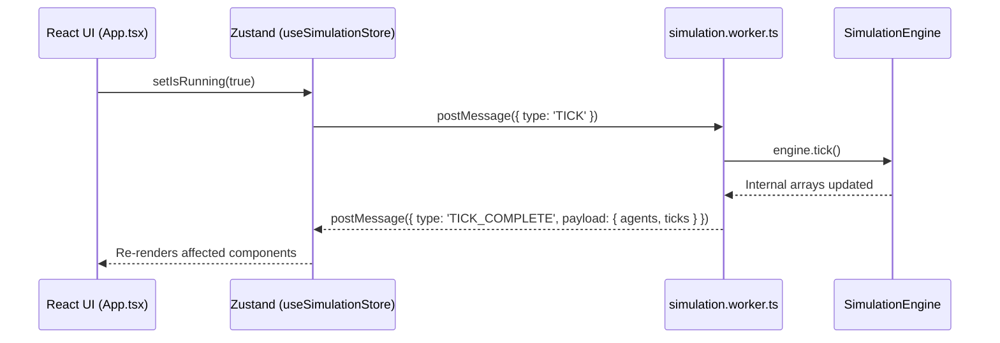

# Clinical AI Studio Architecture

This document maps the async architectural foundations of the Clinical AI Studio, emphasizing how the pure medical twin logic interfaces with the React UI via Web Workers and Zustand.

## Core Pillars

1. **Deterministic Testing:** All biological and clinical engines (e.g. `BiologicalDecayEngine.ts`, `PredictiveEngine.ts`) are completely mathematically isolated and strictly unit tested using Vitest.
2. **Web Worker Orchestration (`simulation.worker.ts`):** 100% of mathematical processing occurs off the main DOM thread.
3. **Zustand Inter-Process Communication (IPC):** The UI reads data strictly from a unified React store which proxies requests seamlessly to the Worker.
4. **Client-Side Routing (`react-router-dom`):** Decoupled from massive monolithic parent views, allowing direct deep-linking and granular active route mounting.
5. **Atomic Component Architecture (`src/components/ui/`):** Strict decomposition of complex views into reusable UI components (`<StatCard>`, `<ProgressBar>`, `<RangeSlider>`), with explicitly centralized TypeScript interfaces inside `src/types/index.ts` to enforce deterministic data flows.

## The Worker Data Flow Diagram

## State Sub-Systems

### The Knowledge Base
The `KnowledgeNetwork` is inherently non-serializable across worker boundaries due to its heavy global array mutation logic combined with LLM injection capabilities. 

To bridge this:
- The `SimulationEngine` drives the `harvest_literature` PubMed fetch directly within the worker on week loops.
- `KnowledgeBase` statistical aggregates are passed back out to the Zustand store lazily when the UI triggers a `REQUEST_SAVE_PAYLOAD` action for JSON export.

### Custom Deep Learning Cohorts
When a user launches a custom AI optimization trial (`CustomTwinDashboard.tsx`):
- The `handleStartCustomTrial` action dispatches deeply nested patient schemas down to the worker via `INIT_CUSTOM_ENGINE`.
- The worker maintains a secondary, isolated `SimulationEngine` representing the multi-verse timeline.
- The UI controls time dilation via `FAST_FORWARD_CUSTOM`, receiving a monolithic update once the full timeline duration concludes.

## Future ML Model Injections

When porting in PyTorch / ONNX models:
1. Load the ONNX `.wasm` explicitly within the `workers/simulation.worker.ts` context. 
2. Because the Web Worker runs asynchronously off the Main Thread, even massive Transformer inferences won't cause generic frame drops or CSS freezing in the `clinical-ai-studio` styling system.
3. Expand the IPC payload definitions inside `simulation.worker.ts` to accommodate arbitrary tensor diagnostic readouts as needed.
